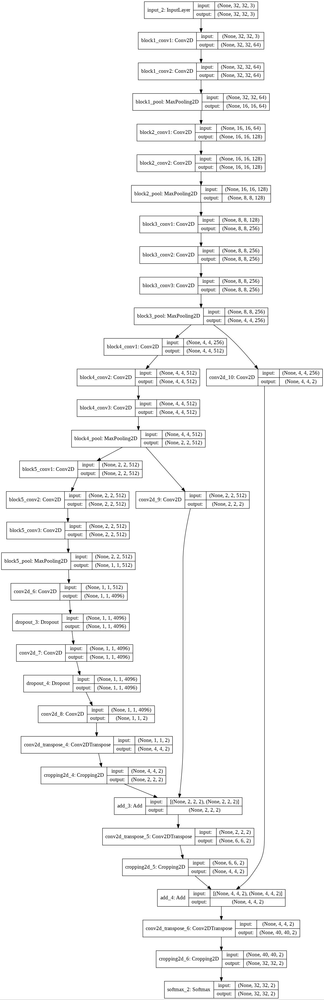

# keras-fcn-segmentation-model


Keras implementation of FCN-8 Semantic Segmentation model.

## Paper Referred

- [Fully Convolutional Networks for Semantic Segmenation](https://arxiv.org/pdf/1411.4038.pdf)

## Quick start

```bash
!git clone https://github.com/naineshhulke/keras-fcn-segmentation-model.git
cd keras-fcn-segmentation-model

# example for getting a keras model instance

from fcn import *

n_classes = 2          # Total number of classes
shape = ( 32,32,3 )    # Image Shape

x = fcn8( n_classes , shape )
model = x.get_model()

# plot the keras model in file 'model.jpg' by 

visualize( model , 'model.jpg' )
```

Proposed Model architecture:



